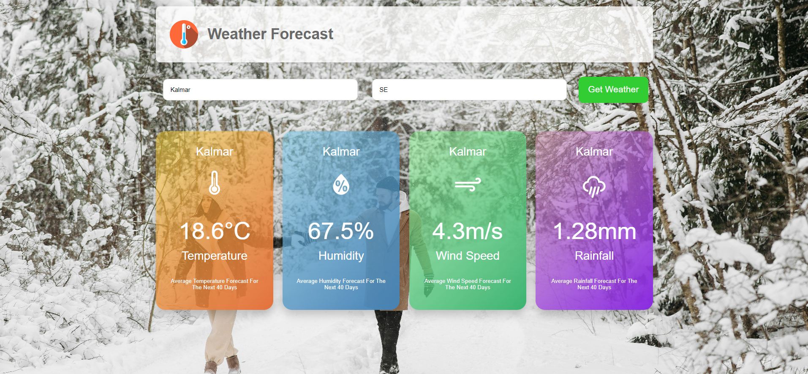

# Weather Forecast Application

Welcome to the Weather Forecast Application! This user-friendly tool allows you to obtain a comprehensive 40-day weather forecast for any city worldwide. By leveraging data from the OpenWeatherMap API, our application processes and presents average weather conditions in an intuitive and visually appealing interface.

## Key Features:

- **Global Coverage**: Search for any city across the globe using the city's name and the corresponding country code.
- **Detailed Forecasts**: Receive average weather data for the next 40 days, including temperature, humidity, wind speed, and rainfall.
- **Data Visualization**: Weather data is displayed in colorful, easy-to-read cards, making it simple to understand at a glance.
- **User-Friendly Interface**: The clean and modern design ensures a seamless user experience, whether you're a casual user or a weather enthusiast.

## How It Works:

1. **Input**: Enter the desired city's name and the country's code in the search fields.
2. **Data Retrieval**: Our application fetches the latest weather data from the OpenWeatherMap API.
3. **Data Processing**: The received data is averaged over 40 days to provide a reliable long-term forecast.
4. **Presentation**: The processed data is displayed in vibrant, color-coded cards, each representing a different weather parameter.

## Example Usage:

- **City**: Kalmar
- **Country Code**: SE (Sweden)

Upon entering "Kalmar" and "SE" into the search fields, you'll receive an average forecast for temperature, humidity, wind speed, and rainfall in Kalmar over the next 40 days. The data is presented in neatly arranged cards, with each card highlighting a specific weather metric.

## Why Use Our Application?

- **Accurate Forecasts**: By using average data, our application provides a reliable overview of future weather conditions.
- **Visual Appeal**: The colorful and modern design makes the weather information accessible and enjoyable to read.
- **Ease of Use**: Simple search functionality ensures that you can quickly find the weather forecast for any city.

Start using our Weather Forecast Application today to stay informed about the weather conditions in your city or any other city around the world!

### Home page:
